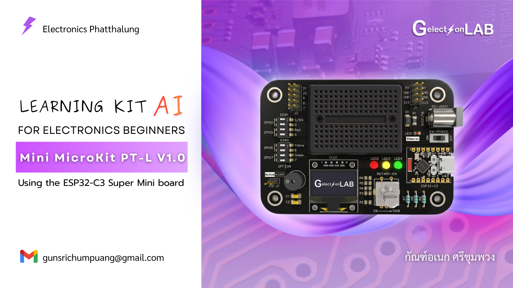
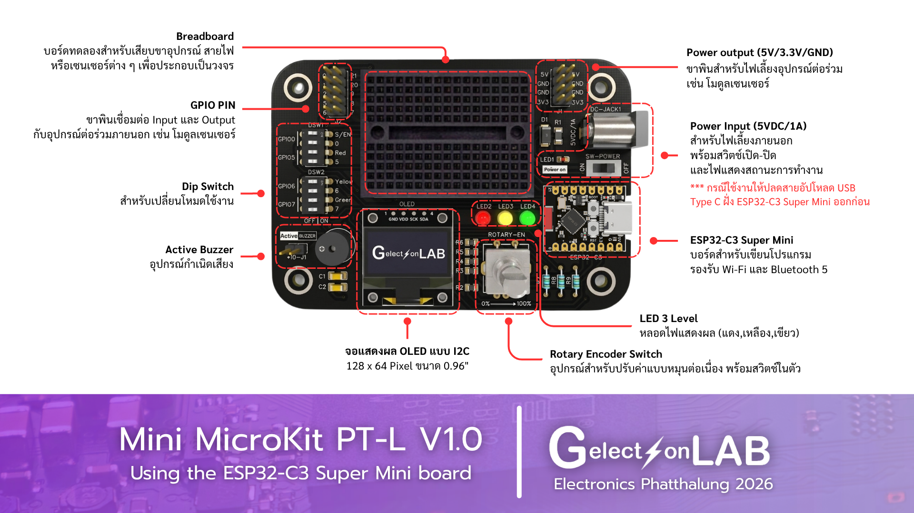
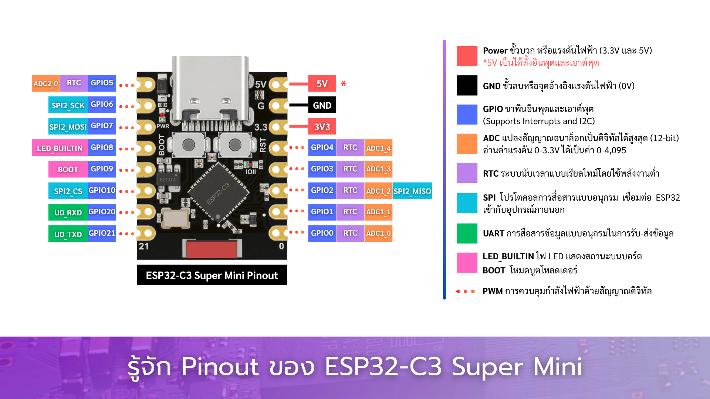

```text
Board : Mini MicroKit PT-L V1.0
MCU : ESP32-C3 Supermini
Library : MiniMicroKit_PTL
Dev : Gelectron
Country : Thailand

-----------------------------------------------------------------------------
Using PIN
-----------------------------------------------------------------------------
*Rotary Encoder Switch
CLK = GPIO3 
DT = GPIO4
SW = GPIO0 Select mode DIP switch

*LED 3 Level
Red = GPIO5 Select mode DIP switch
Yellow = GPIO6 Select mode DIP switch
Green = GPIO7 Select mode DIP switch

*Active Buzzer = GPIO10

*OLED-0.96" i2c (128x64)
SDA = GPIO2
SCL = GPIO1

*Dip Switch
GPIO0 = SW(Rotary Encoder Switch) || Pin header Pin 0
GPIO5 = LED(Red) || Pin header Pin 5
GPIO6 = LED(Yellow) || Pin header Pin 6
GPIO7 = LED(Green) || Pin header Pin 7

*Pin header (GPIO PIN)
Pin 0 = Select mode DIP switch
Pin 1(SCL) = Use with OLED and other I2C devices
Pin 2(SDA) = Use with OLED and other I2C devices
Pin 5 = Select mode DIP switch
Pin 6 = Select mode DIP switch
Pin 7 = Select mode DIP switch
Pin 8
Pin 9
Pin 20(RX)
Pin 21(TX)

-----------------------------------------------------------------------------
Basic functions can be found in the examples of the MiniMicroKit_PTL library.
-----------------------------------------------------------------------------
